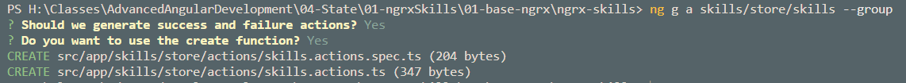

# State Management using NgRx

[NgRx Docs](https://ngrx.io/docs)

## Demos:

- 01-ngstate: Stateful Service, EventBus, NgRx Demo Showcase
- 02-ngrx-skills: NgRx Implementation with Detailed Guide
- 03-ngrx-skills-steps: Older Sample with 5 steps in seperate folders

## Installation:

> Note: Some Hints in this Guide assume that you are using the [NgRx Snippets - VS Code Extension](https://marketplace.visualstudio.com/items?itemName=hardikpthv.NgRxSnippets)

```
npm i @ngrx/store @ngrx/effects @ngrx/entity -S
npm i @ngrx/store-devtools -D
ng add @ngrx/schematics
```

> Note: Answer the question "Do you want to use @ngrx/schematics as the default collection" with yes

## Schematics Overview

[NgRx Schematics Docs](https://ngrx.io/guide/schematics/store)

Shortcuts: a: Action, r: Reducer, ef: Effekt, se: Selector

General Syntax: ng g TYPE PATH/NAME --group

> Note: Path can be PATH/SUBPATH/Name

## Store & App State

Create Store:

```
 ng g store State --root true --statePath store
```

Add Store to app.module.ts

```typescript
import { reducers, metaReducers } from './store';
import { EffectsModule } from '@ngrx/effects';
import { environment } from 'src/environments/environment';
import { StoreDevtoolsModule } from "@ngrx/store-devtools";

...

StoreModule.forRoot(reducers, {
  metaReducers,
  runtimeChecks: {
    strictStateImmutability: true,
    strictActionImmutability: true
  }
}),
  EffectsModule.forRoot([]),
  !environment.production ? StoreDevtoolsModule.instrument() : [];
```

Implement AppState:

```
ng g r store/app --group
```

Add to `app.reducer.ts`

```typescript
export interface AppState {
  menuVisible: boolean;
}

export const initialState: AppState = {
  menuVisible: true,
};
```

Add to `home.component.html`, also implement an empty `toggleCredits()` in the \*.ts

```html
<div fxLayout="column" fxLayoutAlign="center center">
  <h1>
    Skills Home
  </h1>

  <button mat-raised-button (click)="toggleCredits()">
    Toggle Credits
  </button>
</div>
```

Add Actions:

```
ng g action store/app --group=true --creators=false
```

> Note: Answer all Schematic Params with No

Implement the Action:

```typescript
export enum StoreActionTypes {
  ToggleCredits = '[App] ToggleCredits',
}

export class ToggleCredits implements Action {
  readonly type = AppActionTypes.ToggleCredits;
}

export type StoreActions = ToggleCredits;
```

Create Feature & MenuVisible Selector:

```
 ng g se store/app --group
```

Add the following to `app.selectors.ts`:

```typescript
import { AppState, appFeatureKey } from '../reducers/app.reducer';

export const getAppState = createFeatureSelector<AppState>(appFeatureKey);

export const getCreditsVisible = createSelector(
  getAppState,
  (state: AppState) => state.creditsVisible
);
```

Implement the Reducer:

```typescript
export function reducer(state = initialState, action: Action): AppState {
  switch (action.type) {
    case AppActionTypes.ToggleMenuVisible:
      return { ...state, creditsVisible: !state.creditsVisible };
    default:
      return state;
  }
}
```

Use in `home.component.ts`:

```typescript
constructor(private store: Store<AppState>) {}

menuVisible: Observable<boolean> = this.store.select(getCreditsVisible);

ngOnInit(): void {}

toggleMenu(): void {
  this.store.dispatch(new ToggleCredits());
}
```

Add a div to `home.component.ts`

```
<div *ngIf="menuVisible | async">
  CREDITS
</div>
```

You should be able to toggle the credits now:


## Effects

Install Effects Lib:

```
npm install @ngrx/effects --save
```

Add data to db.json:

```json
"authors": [
  { "id": 1, "mail": "alexander.pajer@integrations.at" },
  { "id": 2, "mail": "andreas.lengauer@integrations.at" }
]
```

Add author actions:

```typescript
export enum AppActionTypes {
  ToggleCredits = '[App] ToggleCredits',
  LoadAuthors = '[App] LoadAuthors',
  LoadAuthorsSuccess = '[App] LoadAuthorsSuccess',
  LoadAuthorsFailure = '[App] LoadAuthorsFailure',
}

export class ToggleCredits implements Action {
  readonly type = AppActionTypes.ToggleCredits;
}

export class LoadAuthors implements Action {
  readonly type = AppActionTypes.LoadAuthors;
}

export class LoadAuthorsSuccess implements Action {
  readonly type = AppActionTypes.LoadAuthorsSuccess;
  constructor(public payload: Author[]) {}
}

export class LoadAuthorsFailure implements Action {
  readonly type = AppActionTypes.LoadAuthorsFailure;
  constructor(public payload: Error) {}
}

// First pipe create by Prettier

export type AppActions =
  | ToggleCredits
  | LoadAuthors
  | LoadAuthorsSuccess
  | LoadAuthorsFailure;
```

Extend AppState:

```typescript
export interface AppState {
  creditsVisible: boolean;
  authors: Author[];
}
```

Extend `app.selectors.ts`:

```typescript
export const getAuthors = createSelector(
  getAppState,
  (state: AppState) => state.authors
);
```

Implement LoadAuthors Effect:

```
ng g ef store/app --group
```

```typescript
@Injectable()
export class AppEffects {
  constructor(private actions$: Actions, private auts: AuthorService) {}

  @Effect()
  loadAuthor$: Observable<Action> = this.actions$.pipe(
    ofType(AppActionTypes.LoadAuthors),
    exhaustMap(() =>
      this.auts.getAuthors().pipe(
        map((authors: Author[]) => new LoadAuthorsSuccess(authors)),
        catchError((err) => of(new LoadAuthorsFailure(err)))
      )
    )
  );
}
```

Add an authors list & add it to `home.component.ts`:

```
ng g c authors/authors-list -m app
```

Add the following html & \*.ts:

```html
<div fxLayout="column" fxLayoutAlign="center center" fxLayoutGap="16px">
  <h2>Credits:</h2>
  <div *ngFor="let a of authors | async">
    {{ a.mail }}
  </div>
</div>
```

```typescript
constructor(private store: Store<AppState>) {}
authors = this.store.select(getAuthors);

ngOnInit(): void {
  this.store.dispatch(new LoadAuthors());
}
```

Replace the HTML in home.components.html:

```html
<div
  *ngIf="creditsVisible | async"
  fxLayout="column"
  fxLayoutAlign="center center"
  fxLayoutGap="16px"
>
  <div><app-authors-list></app-authors-list></div>
</div>
```

## Lazy Loaded Feature Module with NgRx Entity, Facades and Creator Functions

Creator Functions:

- createAction
- createEffect

> Note: If you have not added a skills.module.ts you can do so by using: `ng g module skills --route skills --module app.module.ts`

Add Food Data to db.json & create a skill.model.ts:

```json
"skills": [
  { "id": "123", "name": "rxjs", "completed": true },
  { "id": "456", "name": "ngrx", "completed": false }
]
```

### Schematic Scaffolding

Add NgRx Entity:

```
npm i -S @ngrx/entity
```

Add Skill-Components:

```
ng g c skills/skills-container
ng g c skills/skills-list-with-row
ng g c skills/skill-row
ng g c skills/skills-kpi
```

Add Skill State & Reducer:

```
ng g r skills/store/skills --group
```

Our State should look like this:

```typescript
export interface SkillsState {
  skills: Skill[];
}

export const initialState: SkillsState = {
  skills: [],
};
```

Add Skill Effect:

```
ng g ef skills/store/skills --group
```

Check the skills.module.ts to make sure the skills state is loaded:

```typescript
@NgModule({
  declarations: [SkillsContainerComponent, SkillsListComponent, SkillsKpiComponent],
  imports: [
    CommonModule,
    SkillsRoutingModule,
    StoreModule.forFeature(skillsFeatureKey, reducer),
    EffectsModule.forFeature([SkillsEffects]),
  ],
})
```

Add Skill Selector:

```
ng g se skills/store/skills --group
```

Add a service that we will use as a Facade:

```
ng g s skills/store/facades/skills-facade
```

> Note: You will need to implement the service CRUD using `http://localhost:3000/skills`

### Skills Feature Module Implementation

Add the Skill Actions & answer Schematic Params accodingly:

```
ng g a skills/store/skills --group
```



We now have saved us from writing a lot of boilerplate & just have to correct the Type of Success and Failure

```typescript
export const loadSkills = createAction('[Skills] Load Skills');

export const loadSkillsSuccess = createAction(
  '[Skills] Load Skills Success',
  props<{ data: Skill[] }>()
);

export const loadSkillsFailure = createAction(
  '[Skills] Load Skills Failure',
  props<{ error: Error }>()
);

// addSkill action -> easy creation using: ngrx-create-action-props
export const addSkill = createAction('[Skills] Add', props<{ data: Skill }>());

export const addSkillsSuccess = createAction(
  '[Skills] Add Skills Success',
  props<{ data: Skill }>()
);

export const addSkillsFailure = createAction(
  '[Skills] Add Skills Failure',
  props<{ error: Error }>()
);

// just a mock to save time - not persisted
export const toggleSkillComplete = createAction(
  '[Skill] Toggle Skill Complete',
  props<{ data: Skill }>()
);

// just a mock to save time - not persisted
export const deleteSkill = createAction(
  '[Skills] Delete Skill',
  props<{ data: Skill }>()
);

//  just a mock to save time - not persisted
export const deleteSkillsFailure = createAction(
  '[Skills] Delete Skills Failure',
  props<{ error: Error }>()
);
```

Create Effect:

```
ng g ef skills/store/skills --group
```

> Note: To implement the Effect you could use the `ngrx-effect` Snippet

```typescript
  @Effect()
  loadSkills$ = this.actions$.pipe(
    ofType(loadSkills),
    switchMap((action) => {
      return this.service.getSkills().pipe(
        map((data) => loadSkillsSuccess({ data })),
        catchError((error) => error)
      );
    })
  );

  @Effect()
  addSkill$ = this.actions$.pipe(
    ofType(addSkill),
    switchMap((action) => {
      return this.service.addSkill(action.data).pipe(
        map((sk) => addSkillsSuccess({ data: sk })),
        catchError((error) => error)
      );
    })
  );
```

Skills Facade:

```typescript
export class SkillsFacadeService {
  constructor(private store: Store<SkillsState>) {}

  initSkills(): void {
    this.store.dispatch(loadSkills());
  }

  getSkills(): Observable<Skill[]> {
    return this.store.select(getAllSkills);
  }

  addSkill(s: Skill): void {
    this.store.dispatch(addSkill({ data: s }));
  }

  deleteSkill(s: Skill): void {
    this.store.dispatch(deleteSkill({ data: s }));
  }

  toggleComplete(s: Skill): void {
    this.store.dispatch(toggleSkillComplete({ data: s }));
  }
}
```

Implement Skills-List

\*.html:

```html
<mat-toolbar color="primary">
  <mat-toolbar-row fxLayoutAlign="space-between center">
    <div>SPA Skills</div>
    <div fxLayoutGap="10px">
      <button mat-raised-button (click)="addItem()">Add</button>
      <mat-slide-toggle [formControl]="fcToggle" color="accent">
        ShowAll
      </mat-slide-toggle>
    </div>
  </mat-toolbar-row>
</mat-toolbar>

<mat-card>
  <mat-card-content fxLayout="column">
    <ng-container *ngFor="let sk of view$ | async" class="item">
      <app-skill-row
        [skill]="sk"
        (itemDeleted)="deleteItem($event)"
        (itemCompleted)="toggleItemComplete($event)"
      ></app-skill-row>
    </ng-container>
  </mat-card-content>
</mat-card>
```

\*.ts

```typescript
export class SkillListWithRowComponent implements OnInit {
  constructor(private sf: SkillsFacadeService) {}

  skills$ = this.sf.getSkills();
  // Remove 'true' and it does not work
  fcToggle = new FormControl(true);

  view$ = combineLatest([
    this.skills$,
    this.fcToggle.valueChanges.pipe(startWith(true)),
  ]).pipe(
    map(([skills, showAll]) => {
      return showAll ? skills : skills.filter((sk) => sk.completed === showAll);
    })
  );

  ngOnInit(): void {}

  toggleShowAll(): void {}

  addItem(): void {
    const newItem: Skill = { name: 'Container', completed: false };
    this.sf.addSkill(newItem);
  }

  deleteItem(item: Skill): void {
    this.sf.deleteSkill(item);
  }

  toggleItemComplete(item: Skill): void {
    this.sf.toggleComplete(item);
  }
}
```

Implement Skill-Row:

\*.html:

```html
<div fxLayout="row" fxLayoutAlign="space-between center" fxFill class="row">
  <div fxFlex="3 1 auto" style="padding-left: 2rem;">{{ skill?.name }}</div>
  <div fxFlex="1 1 140px">
    <mat-slide-toggle
      color="primary"
      (change)="toggleItemCompleted(skill)"
      [checked]="skill?.completed"
      >Completed</mat-slide-toggle
    >
  </div>
  <div fxFlex="1 1 80px">
    <button mat-raised-button color="primary" (click)="deleteItem(skill)">
      <mat-icon>delete</mat-icon>
    </button>
  </div>
</div>
```

\*.ts:

```typescript
export class SkillRowComponent implements OnInit {
  @Input() skill: Skill;
  @Output() itemDeleted: EventEmitter<Skill> = new EventEmitter();
  @Output() itemCompleted: EventEmitter<Skill> = new EventEmitter();

  constructor() {}

  ngOnInit(): void {}

  deleteItem(item: Skill): void {
    this.itemDeleted.emit(item);
  }

  toggleItemCompleted(item: Skill): void {
    this.itemCompleted.emit(item);
  }
}
```
