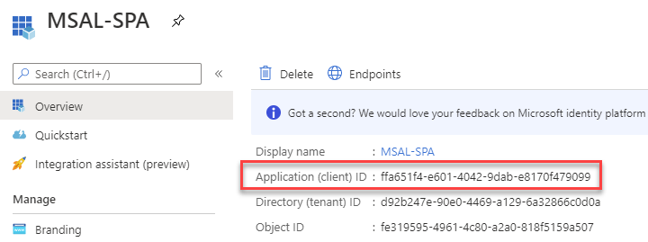

# Routing & Security using NgRx

## Demos

- 01-routing-security: Main Demo of this Module
- 02-firebase-auth-nongrx: Revisit Tokenbased Auth without NgRx
- 03-azuread-msal: Using MSAL and Microsoft Identity (akn AzureAD)

## Routing

### Routing and NgRx

Add Routing:

```
ng add @ngrx/router-store
```

## Security

### Configure SSL in Angular

- Execute `bash generate.sh` `create-certs\` in Git Bash to create certs.
- Copy `server.crt`and `server.key` to newly created `ssl` folder of Angular project.`
- Register in `angular.json`

```typescript
"serve": {
    "builder": "@angular-devkit/build-angular:dev-server",
    "options": {
        "browserTarget": "HelloSSL:build",
        "ssl": true,
        "sslKey": "/ssl/server.key",
        "sslCert": "/ssl/server.crt"
    },
```

Get Chrome to trust self signed localhost:

```
chrome://flags/#allow-insecure-localhost
```

### Token based Authentication

[JSON Web Tokens - Jwt](https://jwt.io/)

[OpenID Connect](https://connect2id.com/learn/openid-connect)

### Firebase

[Firebase](https://firebase.google.com/)

[Firebase Auth](https://firebase.google.com/docs/auth)

### Azure AD - Microsoft Authentication Library (MSAL) - Angular

[MSAL for JavaScript](https://github.com/AzureAD/microsoft-authentication-library-for-js)

[MSAL for Angular](https://github.com/AzureAD/microsoft-authentication-library-for-js/tree/dev/lib/msal-angular)

[MSAL Excample](https://docs.microsoft.com/en-us/samples/azure-samples/active-directory-javascript-singlepageapp-angular/active-directory-javascript-singlepageapp-angular/)

#### AzureAD-MSAL Sample

A sample demonstrating Microsoft Identity Authentication (former AzureAD) & Authorization inkluding MS Graph

[Azure Trial Account](https://azure.microsoft.com/en-us/free/)

[Microsoft 365 Developer Account - Free](https://developer.microsoft.com/en-us/microsoft-365/dev-program)

[Azure CLI Installation Guide](https://docs.microsoft.com/en-us/cli/azure/install-azure-cli?view=azure-cli-latest)

Create Microsoft Identity App Registration:

Execute `create-msal-app-reg.azcli`.

> Note: For smoothe execution in VS Code install [Azure CLI Tools](https://marketplace.visualstudio.com/items?itemName=ms-vscode.azurecli) and [Azure Account](https://marketplace.visualstudio.com/items?itemName=ms-vscode.azure-account)

Check AppRegistration:



To make this sample work with your own AppRegistration update `clientId` in `app.module.ts`:

```typescript
function MSALConfigFactory(): Configuration {
  return {
    auth: {
      clientId: 'ffa651f4-e601-4042-9dab-e8170f479099',
      authority: 'https://login.microsoftonline.com/common/',
      validateAuthority: true,
      redirectUri: 'http://localhost:4200/',
      postLogoutRedirectUri: 'http://localhost:4200/',
      navigateToLoginRequestUrl: true,
    },
    cache: {
      cacheLocation: 'localStorage',
      storeAuthStateInCookie: isIE, // set to true for IE 11
    },
  };
}
```

### .NET Core Auth

[.NET Core Identity](https://docs.microsoft.com/en-us/aspnet/core/security/authentication/identity?view=aspnetcore-2.2&tabs=visual-studio)

[.NET Core Authentication Snippets](https://docs.microsoft.com/en-us/aspnet/core/security/authentication/social/microsoft-logins?view=aspnetcore-2.2)
