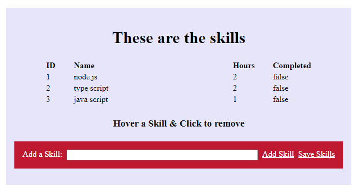

# Angular Elements

[Angular Elements](https://angular.io/guide/elements)

## Base Web Standards

[Shadow DOM](https://developer.mozilla.org/en-US/docs/Web/Web_Components/Using_shadow_DOM)

[Custom Elements](https://developer.mozilla.org/en-US/docs/Web/Web_Components/Using_custom_elements)

[Web Templates](https://developer.mozilla.org/en-US/docs/Web/Web_Components/Using_templates_and_slots)

> Note: Samples provided in `./custom-elements`

## Getting started:

### Project Setup & Add Elements

```
ng new skills-elements
cd skills-elements
code .
ng add @angular/elements
```

Add Polyfills:

```
npm install -S @webcomponents/webcomponentsjs @webcomponents/custom-elements
```

Add the Polyfills to the polyfills.ts:

```typescript
import '@webcomponents/custom-elements/src/native-shim';
import '@webcomponents/custom-elements/custom-elements.min';
```

Add ngx-build-plus:

```
ng add ngx-build-plus
```

### Implement Component designated to be you Custom Element

Add a Component using:

```
ng g c skills-list
```

Add a skill.model.ts file:

```typescript
export class Skill {
  id: number;
  name: string;
  hours: number;
  completed: boolean = false;
}
```

Add an `Skill[]` as `@Input()` and create a Button that triggers the current `Skill[]` as `@Output()`

```typescript
@Input() skills: Skill[];
@Output() skillsSaved: EventEmitter<Skill[]> = new EventEmitter();
skillToAdd: string;
```

Create the following data to `app.component.ts`:

```typescript
data = [
  { id: 1, name: 'node.js', hours: 2, completed: false },
  { id: 2, name: 'type script', hours: 2, completed: false },
  { id: 3, name: 'java script', hours: 1, completed: false },
];
```

Add skills-list to `app.component.html`:

```html
<app-skills-list
  [skills]="data"
  (skillsSaved)="onSave($event)"
></app-skills-list>
```

> Note: You will have to implement onSave in `app.component.ts`

Your result should look somehow like this:



### Build & Package

Modify App Module to create the CustomElement:

```typescript
import { NgModule, Injector } from '@angular/core';
import { createCustomElement } from '@angular/elements';

@NgModule({
  declarations: [SkillsListComponent],
  imports: [BrowserModule, FormsModule],
  entryComponents: [SkillsListComponent],
})
export class AppModule {
  constructor(private injector: Injector) {}

  ngDoBootstrap(): void {
    const el = createCustomElement(SkillsListComponent, {
      injector: this.injector,
    });

    customElements.define('ng-skills', el);
  }
}
```

Add custom build script to `package.json`

```
"build-elements": "ng build --prod --keep-polyfills --single-bundle true --output-hashing none"
```

Create the build:

```
npm run build-elements
```

### Testing your Web Component created with Angular Elements

Modify the HTML in `./dist/skills-elements/index.html` for Testing:

```html
<!DOCTYPE html>
<html lang="en">
  <head>
    <meta charset="utf-8" />
    <title>NgSkillsCE</title>
    <base href="/" />
    <meta name="viewport" content="width=device-width, initial-scale=1" />
    <link rel="icon" type="image/x-icon" href="favicon.ico" />
  </head>
  <body>
    <ng-skills></ng-skills>
    <script src="polyfills-es5.js" nomodule defer></script>
    <script src="polyfills-es2015.js" type="module"></script>
    <script src="scripts.js" defer></script>
    <script src="main-es2015.js" type="module"></script>
    <script src="main-es5.js" nomodule defer></script>
  </body>
</html>
```

To set the `@Input()` and handle the `@Output()` add the following script to the head of the `index.html`:

```javascript
<script>
  document.addEventListener("DOMContentLoaded", function (event) {
    const element = document.getElementsByTagName("ng-skills")[0];
    if (element) {
      // pass data
      const data = [
        { id: 1, name: "node.js", hours: 2, completed: false },
        { id: 2, name: "type script", hours: 2, completed: false },
        { id: 3, name: "java script", hours: 1, completed: false },
      ];
      element.skills = data;
      // handle event
      element.addEventListener("skillsSaved", (data) =>
        console.log("Data received from ng-skills:", data.detail)
      );
    }
  });
</script>
```

Install a tool that can serve static pages, ie `angular-http-server`:

```
npm i -g angular-http-server
angular-http-server -p 9000
```

Navigate to: `http://localhost:9000/`

#### Create a Single File Bundle - Optional

If you want to create `ONE SINGLE FILE` you can use an older approach to concat the files:

Install `npm install --save-dev concat fs-extra`

Add `elements-build.js` to root folder

```javascript
const fs = require('fs-extra');
const concat = require('concat');

(async function build() {
  const files = [
    './dist/nge-skills/runtime.js',
    './dist/nge-skills/polyfills.js',
    './dist/nge-skills/scripts.js',
    './dist/nge-skills/main.js',
  ];

  await fs.ensureDir('elements');
  await concat(files, 'elements/nge-skills.js');
  await fs.copyFile('./dist/nge-skills/styles.css', 'elements/styles.css');
})();
```
