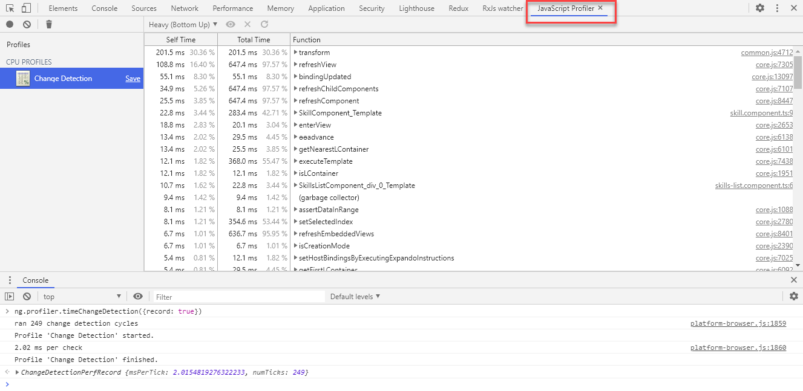

# Optimizing Angular

[Lighthouse](https://developers.google.com/web/tools/lighthouse)

[Angular AOT Compiler](https://angular.io/guide/aot-compiler)

[Angular Debug Statements](https://angular.io/api/core/global)

[Airbnb Style Guide](https://github.com/webdev-tools/tslint-airbnb-styleguide)

[Configuring CommonJS dependencies](https://angular.io/guide/build#configuring-commonjs-dependencies)

## Analyzing Bundles

[Performance Budget Calculator](https://perf-budget-calculator.firebaseapp.com/)

[ngx-quickling - preloading](https://github.com/mgechev/ngx-quicklink)

### Source Maps Explorer

Install Source Map Explorer:

```
npm i -S source-map-explorer
```

Create Production Build:

```
ng build --prod
```

Analyze Chunks:

```
source-map-explorer dist/main-es5.28a67cbad0b0a3f17e1e.js
```

## Change Detection

Parts of the slides are taken from:

[The Last Guide For Angular Change Detection You'll Ever Need - (c) Michael Hoffmann](https://www.mokkapps.de/blog/the-last-guide-for-angular-change-detection-you-will-ever-need/#:~:text=By%20default%2C%20Angular%20Change%20Detection,which%20produces%20VM%2Doptimized%20code.)

Enable Angular Debug Tools in `main.ts`:

```
platformBrowserDynamic()
  .bootstrapModule(AppModule)
  .then(moduleRef => {
    const applicationRef = moduleRef.injector.get(ApplicationRef);
    const componentRef = applicationRef.components[0];
    // allows to run `ng.profiler.timeChangeDetection();`
    enableDebugTools(componentRef);
  })
  .catch(err => console.error(err));
```

Run App, select sample 'Change Detection' open console and enter:

```
ng.profiler.timeChangeDetection()
```

Change ChangeDetectionStrategy in `skills-list.component.ts` and compare values

Using `Running ng.profiler.timeChangeDetection({record: true})` allows you to see a detailed execution report using JavaScriptProfiler


