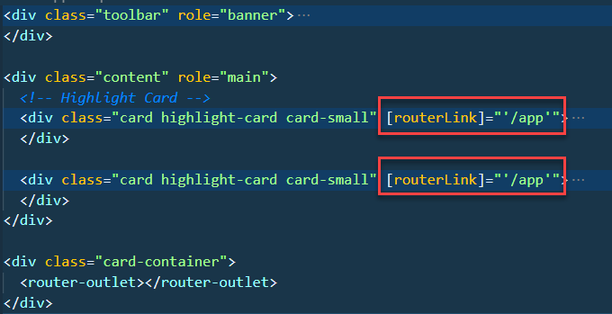

# Code Splitting & Preloading

## Code Splitting

Create the base project:

```
ng new skills-code-split
cd skills-code-split
```

Create the App Shell:

```
ng g module appshell --route app --module app
```

Add a base Layout:



Add the following html to appshell.component.html:

Creat two Auto code splitted modules:

```
ng g module skills --route skills --module appshell
ng g module about --route about --module appshell
```

Change `appshell-routing.module.ts` to use child routing:

```
const routes: Routes = [
  {
    path: '',
    component: AppshellComponent,
    children: [
      {
        path: 'skills',
        loadChildren: () =>
          import('../skills/skills.module').then((m) => m.SkillsModule),
      },
      {
        path: 'about',
        loadChildren: () =>
          import('../about/about.module').then((m) => m.AboutModule),
      },
    ],
  },
];
```

## Preloading

[ngx-quicklink](https://github.com/mgechev/ngx-quicklink)

Add Quicklink and investigate load times:


