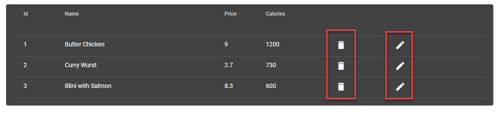
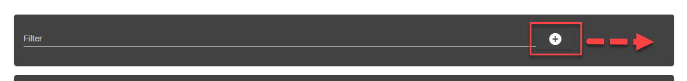

# Food App Project

## Tasks

- Migrate Foode Edit Form to a Reactive Form:

```
<mat-card>
  <mat-card-header>
    <mat-card-title>Edit</mat-card-title>
  </mat-card-header>
  <mat-card-content fxLayout="column" fxLayoutAlign="center start">
    <mat-form-field>
      <input matInput type="text" placeholder="Name" [(ngModel)]="food.name" />
    </mat-form-field>
    <mat-form-field>
      <input
        matInput
        type="number"
        placeholder="Price"
        [(ngModel)]="food.price"
      />
    </mat-form-field>
    <mat-form-field>
      <input
        matInput
        type="number"
        placeholder="Calories"
        [(ngModel)]="food.calories"
      />
    </mat-form-field>
  </mat-card-content>
  <mat-card-actions align="end">
    <button mat-raised-button color="primary" (click)="doSave()">Save</button>
  </mat-card-actions>
</mat-card>

```

- Add and implement Edit and Delete Buttons



- Implement a Custom Material Theme with a Custom Color Scheme

- Refactor the Filter to use its own component. Fix the optical bug in the filter bar


